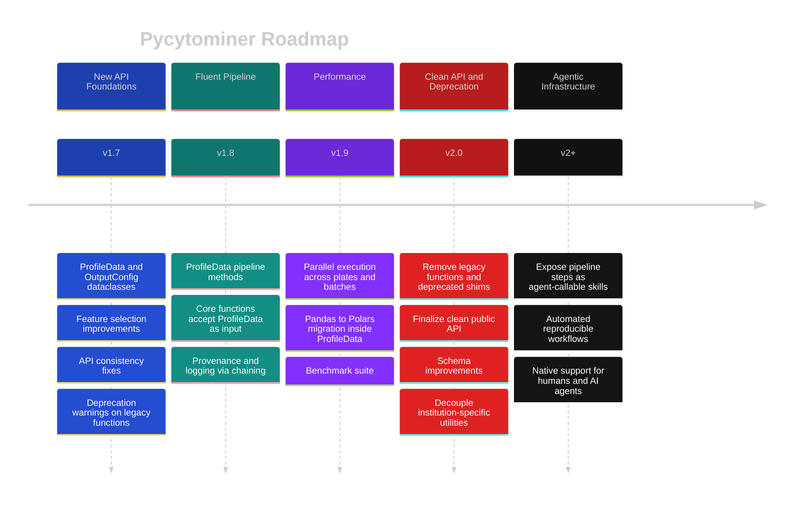

# Pycytominer Roadmap

Pycytominer's vision is to perform the image-based profiling pipeline **reproducibly and extremely fast** for humans and AI agents.
This roadmap outlines the milestones toward a v2 release that fulfills that vision through a modernized API, a structured data model, and a high-performance DataFrame backend.



---

## Current State — v1.6

Pycytominer provides a suite of standalone functions (`aggregate`, `normalize`, `annotate`, `feature_select`, `consensus`) that cover the full image-based profiling pipeline.
The library supports multiple file formats (CSV, Parquet, AnnData, CytoTable Warehouse), runs on Linux, macOS, and Windows, and is tested across Python 3.10–3.14.

---

## Milestone 1 — API Foundations (v1.7)

**Goal:** Introduce a structured data model and eliminate repeated boilerplate across the API.

### ProfileData

- [ ] Add `ProfileData` dataclass ([#327](https://github.com/cytomining/pycytominer/issues/327)) to bundle a DataFrame with its resolved feature and metadata column lists so they are computed once, not inferred repeatedly across function calls
- [ ] Add `OutputConfig` dataclass to consolidate the four repeated output parameters (`output_file`, `output_type`, `compression_options`, `float_format`) shared across all core functions into a single per-call object

### Feature Selection

- [ ] Faster correlation computation ([#633](https://github.com/cytomining/pycytominer/issues/633))
- [ ] Numerical variance filtering ([#656](https://github.com/cytomining/pycytominer/issues/656))
- [ ] Rename variance thresholding for clarity ([#634](https://github.com/cytomining/pycytominer/issues/634))

### API Consistency

- [ ] Align `aggregate` parameter naming with other core functions ([#635](https://github.com/cytomining/pycytominer/issues/635))
- [ ] Improve `annotate` to avoid unintended column renaming ([#660](https://github.com/cytomining/pycytominer/issues/660))
- [ ] Minor schema decisions (e.g., handling of location columns ([#224](https://github.com/cytomining/pycytominer/issues/224)))

### Documentation

- [ ] Fix `Returns` docstrings across all core functions ([#636](https://github.com/cytomining/pycytominer/issues/636))

---

## Milestone 2 — Fluent Pipeline (v1.8)

**Goal:** Make `ProfileData` the primary entry point for running the profiling pipeline (still supporting original API), enabling method chaining and natural provenance tracking.

- [ ] Add pipeline methods to `ProfileData` (`.normalize()`, `.feature_select()`, `.aggregate()`, `.annotate()`, `.consensus()`) — each delegates to the existing standalone function and returns a new `ProfileData`
- [ ] Core functions accept `ProfileData` as input in addition to `str` / `pd.DataFrame` — no breaking changes
- [ ] Provenance and logging emerge naturally from chaining: for example, callers can compare `.features` before and after `feature_select` to see exactly which features were dropped by which operation

```python
# Example chaining
result = (
    ProfileData.from_file("profiles.parquet")
    .aggregate(strata=["Metadata_Well"])
    .normalize(method="standardize", samples="Metadata_treatment == 'DMSO'")
    .feature_select(operations=["variance_threshold", "correlation_threshold"])
)
```

---

## Milestone 3 — Parallelization and High Performance Backend (v1.9)

**Goal:** Make pycytominer extremely fast by enabling parallel execution across the pipeline.

- [ ] Parallel execution of independent pipeline steps across plates, batches, or wells
- [ ] Leverage `ProfileData` as the natural unit of parallelism — each object is self-contained and stateless
- [ ] Benchmark suite to track performance across releases

### Polars Migration

- [ ] Swap the DataFrame backend inside `ProfileData` from pandas to Polars — the change is contained within `ProfileData`, isolating all call sites from the migration
- [ ] Validate performance improvements across the full pipeline
- [ ] Maintain backward compatibility where possible; document breaking changes clearly

---

## Milestone 4 — Clean API (v2.0)

**Goal:** Finalize a clean, stable public API, deprecate old institution-specific functions and introduce other minor, but breaking changes (e.g., some stale parameter names).

### API Cleanup

- [ ] Deprecate and remove legacy API ([#705](https://github.com/cytomining/pycytominer/issues/705))
- [ ] Remove `normalize()` string-encoded missing value shim ([#646](https://github.com/cytomining/pycytominer/issues/646))
- [ ] Decouple `format_broad_cmap` / `clean_cellprofiler` ([#625](https://github.com/cytomining/pycytominer/issues/625))
- [ ] Refactor `SingleCells` ([#269](https://github.com/cytomining/pycytominer/issues/269))
- [ ] Replace `csv.sniffer` ([#704](https://github.com/cytomining/pycytominer/issues/704))
- [ ] Retire `collate.py` upload/download flags ([#231](https://github.com/cytomining/pycytominer/issues/231))
- [ ] Fix `collate.py` compartment handling ([#272](https://github.com/cytomining/pycytominer/issues/272))

---

## Beyond v2 — Agentic Infrastructure

**Goal:** Make pycytominer natively usable by AI agents as a set of composable, callable skills.

The fluent `ProfileData` pipeline and the clean v2 API lay the groundwork for exposing pycytominer's capabilities as agent-callable tools. At this stage, individual pipeline steps (normalize, feature_select, aggregate, etc.) can be registered as skills that an AI agent can discover, invoke, and chain autonomously — enabling fully automated, reproducible profiling workflows driven by natural language or high-level objectives.

This is exploratory and will be shaped by the broader ecosystem of agent frameworks and tool standards as they mature.

---

## Contributing

We welcome contributions at any milestone.
See [CONTRIBUTING.md](CONTRIBUTING.md) for setup instructions, coding standards, and how to open a pull request.
