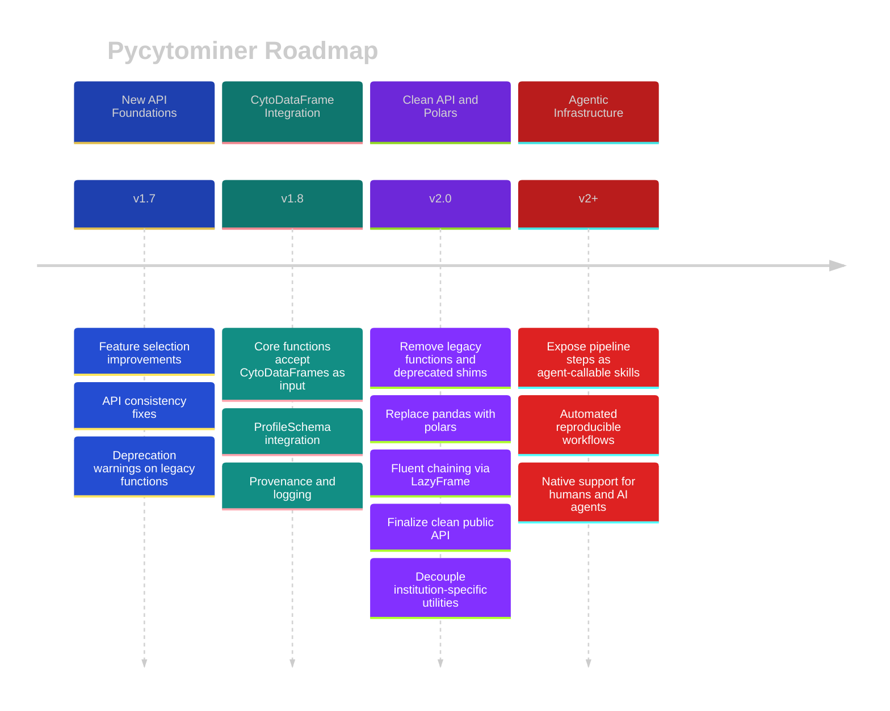

# Pycytominer Roadmap

Pycytominer's vision is to perform the image-based profiling pipeline **reproducibly and extremely fast** for humans and AI agents.
This roadmap outlines the milestones toward a v2 release that fulfills that vision through a modernized API, a shared profile schema, and a high-performance DataFrame backend.



---

## Current State — v1.6

Pycytominer provides a suite of standalone functions (`aggregate`, `normalize`, `annotate`, `feature_select`, `consensus`) that cover the full image-based profiling pipeline.
The library supports multiple file formats (CSV, Parquet, AnnData, CytoTable Warehouse), runs on Linux, macOS, and Windows.
CSV and TSV files are supported across Linux, macOS, and Windows.

---

## Milestone 1 — API Foundations (v1.7)

**Goal:** Ensure consistency in API, add new methods.

### Feature Selection

- [ ] Faster correlation computation ([#633](https://github.com/cytomining/pycytominer/issues/633))
- [ ] Numerical variance filtering ([#656](https://github.com/cytomining/pycytominer/issues/656))
- [ ] Rename variance thresholding for clarity ([#634](https://github.com/cytomining/pycytominer/issues/634))

### API Consistency

- [ ] Align `aggregate` parameter naming with other core functions ([#635](https://github.com/cytomining/pycytominer/issues/635))
- [ ] Improve `annotate` to avoid unintended column renaming ([#660](https://github.com/cytomining/pycytominer/issues/660))
- [ ] Minor schema decisions (e.g., handling of location columns ([#224](https://github.com/cytomining/pycytominer/issues/224)))
- [ ] Consolidate repeated output handling through `write_to_file_if_user_specifies_output_details`, keeping file output as a compatibility path while richer data containers handle persistence outside Pycytominer when appropriate

### Profile Schema

- [ ] Add `ProfileSchema` ([#327](https://github.com/cytomining/pycytominer/issues/327)), a lightweight dataclass that stores resolved metadata and feature column names without wrapping profile data itself
- [ ] Use `ProfileSchema` internally to avoid repeatedly inferring metadata and feature columns across core function calls
- [ ] Keep `ProfileSchema` independent of pandas, Polars, `CytoDataFrame`, and AnnData so each data container can adopt the same schema without becoming a hard dependency

### Documentation

- [ ] Fix `Returns` docstrings across all core functions ([#636](https://github.com/cytomining/pycytominer/issues/636))

---

## Milestone 2 — CytoDataFrame Integration (v1.8)

**Goal:** Integrate `ProfileSchema` across the profiling pipeline so metadata and feature columns are resolved once and shared consistently by standalone functions, `CytoDataFrame`, and optional data adapters.
[`CytoDataFrame`](https://github.com/cytomining/CytoDataFrame) is a cytomining library that provides an in-memory data format for single-cell profiles alongside their corresponding images and segmentation masks.

- [ ] Core functions accept `CytoDataFrame` as input in addition to `str` / `pd.DataFrame` — no breaking changes
- [ ] Store or expose a `ProfileSchema` on `CytoDataFrame` so schema inference is shared with the standalone function API instead of duplicated in a second data wrapper
- [ ] Define a small profile-data protocol for optional adapters, such as `to_profile_dataframe()` plus an optional `schema`, so AnnData and other containers can participate without Pycytominer owning their full object model
- [ ] Capture provenance through logging features

The existing standalone API remains the primary workflow.
Core functions can infer or reuse a `ProfileSchema` internally so callers do not need to explicitly construct a schema before running the pipeline.

```python
import pycytominer as pm

profiles = ...  # Load the data using pandas, pycytominer.load_profiles, or another adapter.
profiles = pm.aggregate(profiles, strata=["Metadata_Well"])
profiles = pm.normalize(profiles, method="standardize", samples="Metadata_treatment == 'DMSO'")
profiles = pm.feature_select(
    profiles,
    operations=["variance_threshold", "correlation_threshold"],
)
```

---

## Milestone 3 — Clean API and Polars (v2.0)

**Goal:** Replace pandas with polars, finalize a clean, stable public API, deprecate old institution-specific functions and introduce other minor, but breaking changes (e.g., some stale parameter names).

### Polars Migration and Fluent Pipeline

- [ ] Swap the DataFrame backend inside `CytoDataFrame` from pandas to Polars
- [ ] Add pipeline methods to `CytoDataFrame` (`.normalize()`, `.feature_select()`, `.aggregate()`, `.annotate()`, `.consensus()`) — each delegates to the existing standalone function and returns a new `CytoDataFrame`
- [ ] Leverage Polars `LazyFrame` so chained pipeline methods execute as a single optimized query plan rather than materializing an intermediate DataFrame at each step
- [ ] Validate performance improvements across the full pipeline

```python
import pycytominer as pm

result = (
    pm.CytoDataFrame(profiles)
    .aggregate(strata=["Metadata_Well"])
    .normalize(method="standardize", samples="Metadata_treatment == 'DMSO'")
    .feature_select(operations=["variance_threshold", "correlation_threshold"])
    .collect()
)
```

### API Cleanup

- [ ] Deprecate and remove legacy API ([#705](https://github.com/cytomining/pycytominer/issues/705))
- [ ] Remove `normalize()` string-encoded missing value shim ([#646](https://github.com/cytomining/pycytominer/issues/646))
- [ ] Decouple `format_broad_cmap` / `clean_cellprofiler` ([#625](https://github.com/cytomining/pycytominer/issues/625))
- [ ] Refactor `SingleCells` ([#269](https://github.com/cytomining/pycytominer/issues/269))
- [x] Replace `csv.Sniffer` ([#704](https://github.com/cytomining/pycytominer/issues/704))
- [ ] Retire `collate.py` upload/download flags ([#231](https://github.com/cytomining/pycytominer/issues/231))
- [ ] Fix `collate.py` compartment handling ([#272](https://github.com/cytomining/pycytominer/issues/272))

---

## Beyond v2 — Agentic Infrastructure

**Goal:** Make Pycytominer natively usable by AI agents as a set of composable, callable skills.

The fluent `CytoDataFrame` pipeline and the clean v2 API lay the groundwork for exposing Pycytominer's capabilities as agent-callable tools.
At this stage, individual pipeline steps (`normalize`, `feature_select`, `aggregate`, etc.) can be registered as skills that an AI agent can discover, invoke, and chain autonomously — enabling fully automated, reproducible profiling workflows driven by natural language or high-level objectives.

This is exploratory and will be shaped by the broader ecosystem of agent frameworks and tool standards as they mature.

---

## Contributing

We welcome contributions at any milestone.
See [CONTRIBUTING.md](CONTRIBUTING.md) for setup instructions, coding standards, and how to open a pull request.
